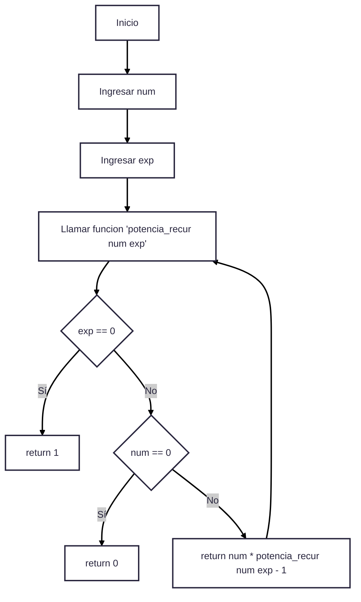

# RETO 8 👽

## Ejercicio 1
- Realizar 3 funciones de retos anteriores en forma de lambdas.
  1. Ejercicio 2 del **Reto 5**.
        ```python
        import math  # Importa el módulo math para poder usar el valor de pi (π)

        # Define una función lambda que calcula el área y perímetro de un rectángulo dados su base (b) y altura (a)
        area_perimetro_rectangulo = lambda b, a: (b * a, 2 * (b + a))

        # Define una función lambda que calcula el área y perímetro de un círculo dado su radio (r)
        area_perimetro_circulo = lambda r: (math.pi * r ** 2, 2 * math.pi * r)

        if __name__ == "__main__":
            # Inputs que solicitan al usuario que ingrese los datos necesarios para el calculo y la convierte a float
            b = float(input("Ingrese la base del rectángulo: "))
            
            a = float(input("Ingrese la altura del rectángulo: "))
            
            r = float(input("Ingrese el radio del círculo: "))

            # llamada de lambdas
            area_rect, perim_rect = area_perimetro_rectangulo(b, a)

            area_circ, perim_circ = area_perimetro_circulo(r)

            area_total = area_rect + 2 * area_circ

            perimetro_total = perim_rect + 2 * perim_circ

            # Impresion de los resultados

            print("Área y perímetro del rectángulo:", area_rect, perim_rect)

            print("Área y perímetro del círculo:", area_circ, perim_circ)
            
            print("Área total:", area_total)

            print("Perímetro total:", perimetro_total)

        ```

        **Diagrama de Flujo**
        ``` mermaid
        ---
        config:
            theme: redux
        ---
        flowchart TD
            A[Inicio] --> B[Ingresar base del rectángulo]
            B --> C[Ingresar altura del rectángulo]
            C --> D[Ingresar radio del círculo]
            D --> E[Llamar funcion area_perimetro_rectangulo]
            D --> F[Llamar funcion area_perimetro_circulo]

            E --> G[Área, perímetro rectángulo]
            F --> H[Área, perímetro círculo]
            
            G --> I[Realizar cálculos]
            H --> I
            I --> J[Área y perímetro totales]
            I --> K[Imprimir resultados]
            K --> L[Final]
        ```

  2. Ejercicio 4 **Reto 4**

        ```python
        if __name__ == "__main__":
            # Ingreso de variables por el usuario
            n1 = float(input("Ingrese un numero"))
            n2 = float(input("Ingrese un numero"))
            # Funcion lambda y llamado de la misma 
            funcion_multiplo = lambda n1,n2 : n1 % n2
            multiplo = funcion_multiplo(n1, n2)
            # Condicionales a modo de respuesta para el usuario
            if multiplo == 0:
                print(f"{n1} es multiplo de {n2}")
            else:
                print(f"{n1} no es multiplo de {n2}")
        ```
        **Diagrama de Flujo**
        ``` mermaid
        ---
        config:
        theme: redux
        ---
        flowchart TD
        A[Inicio] --> B[Entrada n1]
        B --> C[Entrada n2]
        C --> D[Definir función lambda: n1 % n2]
        D --> E[Llamar función y guardar en 'multiplo']
        E --> F{multiplo == 0?}
        F -- Sí --> G[Imprimir: n1 es múltiplo de n2]
        F -- No --> H[Imprimir: n1 no es múltiplo de n2]
        G --> I[Final]
        H --> I

        ```
  2. Ejercicio 4 **Reto 4**

        ```python

        ```
        **Diagrama de Flujo**
        ``` mermaid
        ---
        config:
        theme: redux
        ---


        ```
  

## Ejercicio 3
- Escriba una función recursiva para calcular la operación de la potencia.
```python
# Definimos una función recursiva que calcula la potencia de un número entero
def exp_recur(num: int, exp: int) -> int:
    # Caso base: cualquier número elevado a 0 es 1
    if exp == 0:
        return 1
    # Si el número base es 0 y el exponente no es 0, el resultado es 0
    elif num == 0:
        return 0
    else:
        # Paso recursivo: multiplicamos el número por el resultado de llamarse a sí misma
        # con el exponente reducido en 1
        return num * exp_recur(num, exp - 1)

# Punto de entrada del programa
if __name__ == "__main__":
    # Solicitamos al usuario que ingrese la base (num)
    num = int(input("Ingrese un numero: "))
    
    # Solicitamos al usuario que ingrese el exponente (exp)
    exp = int(input("Ingrese un exponente: "))
    
    # Calculamos la potencia usando la función recursiva
    potencia = exp_recur(num, exp)
    
    # Mostramos el resultado al usuario
    print(f"La potencia de {num} a la {exp} es: {potencia}")

```
**Diagrama de Flujo**


## Ejercicio 4

- **Plantilla para contar el tiempo**
    ```python
    import time

    start_time = time.time()
    # instrucciones sobre las cuales se quiere medir tiempo de ejecución
    end_time = time.time()

    timer = end_time - start_time
    print(timer)
    ```
- **Mi code**
    ```python
    import time

    start_time = time.time()
    # instrucciones sobre las cuales se quiere medir tiempo de ejecución
    numero = 35 # al variar entre 0 y 35, el tiempo de ejecucion no supero los 2.0 segundos
    def fibo_recursivo (numero: int)->int:
    if numero <= 1:
        return 1
    else:
        return fibo_recursivo(numero-1) + fibo_recursivo(numero-2)
    
    end_time = time.time()

    timer = end_time - start_time
    print(fibo_recursivo(numero))
    print(timer)
    ```
Dentr odel intervalo (0,35] la diferencua en el tiempo de  ejecucion no es considerable, sin embargo, al pasar de ahi (a partir de 36 supera 2.0 segundos) el tiempo crece exponencialmente.

- **Observación del hilo de Stackoverflow**

    ```python
    import timeit

    def fibonacci_rec(n):
        if n <= 1:
            return n
        return fibonacci_rec(n-1) + fibonacci_rec(n-2)

    umbral = 2.0
    n = 0

    while True:
        tiempo = timeit.timeit(lambda: fibonacci_rec(n), number=1)
        print(f"n = {n}, tiempo = {tiempo:.4f} segundos")

        if tiempo > umbral:
            print(f"\n Desde n = {n} el tiempo supera los {umbral} segundos.")
            break
        n += 1
    ```
En el [hilo](https://stackoverflow.com/questions/8220801/how-to-use-timeit-module) se explica como usar el modulo **timeit** para medir el tiempo de ejecucion, ademas tambien se explica por que conviene mas utilizar este modulo que **time** (otro modulo para calcular el tiempo) pues este puede verse afectado por procesos en segundo plano del sistema operativo.

Lo realmente importante se encuentra en la variable **tiempo** la cual almacena el tiempo de ejecucion para numeros crecientes de n (por eso el loop infinito) y posteriormente se imprimen las veces que se itero hasta que supere el umbral de tiempo que propuse imprimiendo al finalizar: Desde n = 36 el tiempo supera los 2.0 segundos.

## Mi cuenta de Stackoverflow (5)

[Stackoverflow](https://stackoverflow.com/users/31033491/juan-carlos-polania-bolivar)

## Mi cuenta de Linkedin (6)

[Linkedin](https://www.linkedin.com/in/juan-carlos-polania-bolivar-9733b1373/)

# Autor 🤖
- [Juan Carlos Polania Bolivar](https://github.com/Ciyuang)
